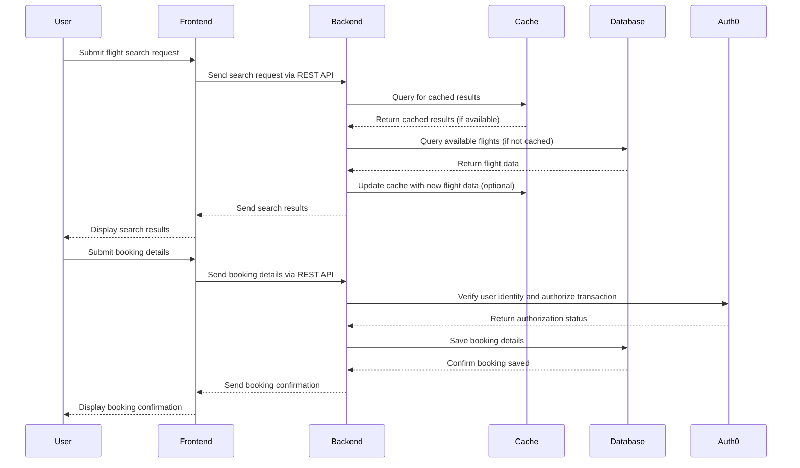

# Secure Flight Search and Booking System

## Overview

This project is a basic flight search and booking system designed to showcase the development of secure travel applications. The system includes both frontend and backend components, focusing on secure user authentication, data transmission, and compliance with GDPR/PDPA principles.

## Features

### Frontend
- **Search Form:** Users can input origin, destination, and travel dates.
- **Search Results:** Displays flight options based on user input.
- **Booking Form:** Captures passenger details and payment information securely.

### Backend
- **RESTful APIs:** Handles flight search requests and bookings.
- **Mock Data:** Uses mock flight data for search results.
- **Secure Storage:** Stores booking information securely in MongoDB.

## Architecture

The system is built using the following technologies:
- **Frontend:** React application using Auth0 for authentication.
- **Backend:** Node.js (NestJS) application with MongoDB as the database and Redis for caching.
- **Docker:** Containerized services for easy deployment and scaling.

## Project Structure

```plaintext
- flight-book-api/        # Backend API service
  - src/
  - Dockerfile
  - .env
- flight-book-app/        # Frontend React application
  - src/
  - Dockerfile
  - .env
- docker-compose.yml      # Docker Compose configuration
- README.md               # Project documentation
```
## Sequence Diagram


## Getting Started

### Prerequisites

- Docker and Docker Compose installed on your machine.

### Setup

1. **Clone the Repository:**

   ```bash
   git clone https://github.com/padstrike/flight-booking.git
   cd flight-booking
   ```

2. **Environment Variables:**

   - **Backend:** (`flight-book-api/.env`) rename file .env.example to .env
   - **Frontend:** (`flight-book-app/.env`) rename file .env.example to .env
   
   Update the `.env` files with your specific environment settings.

3. **Build and Start the Services:**

   ```bash
   docker-compose up --build
   ```

4. **Access the Application:**

   - **Frontend:** [http://localhost:3000](http://localhost:3000)
   - **Backend:** [http://localhost:5000/api](http://localhost:5000/api)

## Services

- **MongoDB:** Running on port 27017.
- **Redis:** Running on port 6379.
- **Backend API:** Running on port 5000.
- **Frontend App:** Running on port 3000.

## Security Considerations

- **User Authentication:** Implemented via Auth0.
- **Encryption:** Sensitive data is encrypted using the provided `ENCRYPTION_KEY` and `ENCRYPTION_IV`.
- **Input Validation:** All user inputs are validated and sanitized to prevent common security threats.
- **GDPR/PDPA Compliance:** User data is handled with care, ensuring compliance with data protection regulations.

## Scaling and Deployment

The system is designed with scalability in mind. Docker Compose makes it easy to scale services horizontally. Consider deploying the application on cloud platforms like AWS, Azure, or Google Cloud for better scalability and availability.

## Troubleshooting

- **Service Not Starting:** Ensure Docker is running and no ports are conflicting with the services.
- **Environment Variables:** Verify that all necessary environment variables are correctly set in the `.env` files.
- **Auth0 Integration Issues:** Ensure that the Auth0 credentials are correct and that your Auth0 tenant is properly configured.
